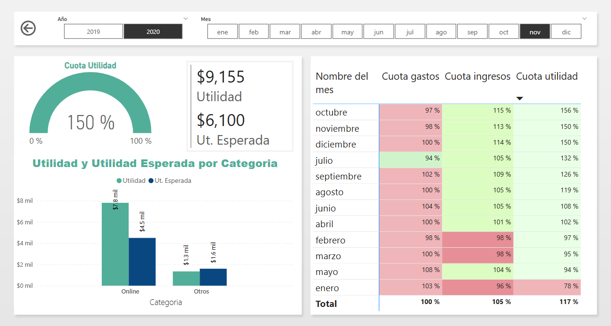

<h1 class="heading-element" dir="auto" tabindex="-1">Finanzas Personales</h1>

Dashboard donde se analizan las finanzas personales,&nbsp; contiene las siguientes p&aacute;ginas:  <strong>1.- Principal</strong>

<strong>2.- Medidas</strong>

<strong>3.- Cuota de Ingreso</strong>

<strong>4.- Detalle de Ingreso</strong>

<strong>5.- Cuota de gastos</strong>

<strong>6.- Detalle de gastos</strong>

<strong>7.- Cuota Utilidad</strong>

<strong>8.- Detalle Utilidad</strong>

<strong>9.- Cuota Saldo</strong>

&nbsp;

<em>El archivo en Power Bi se encuentra en la carpeta Finanzas Personales&nbsp; y la base de datos como las&nbsp; im&aacute;genes en la carpeta Data</em>

&nbsp;

&nbsp;</p