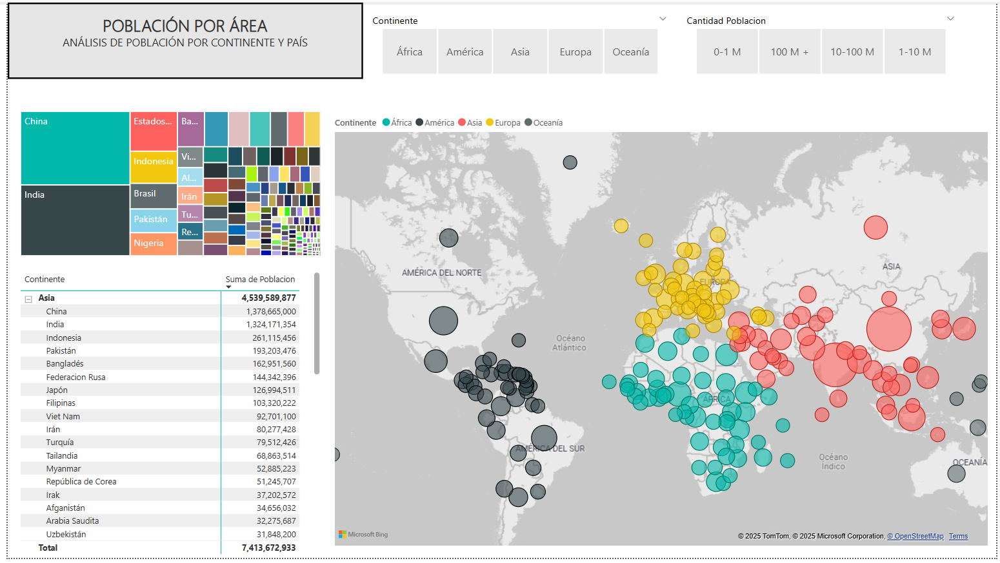
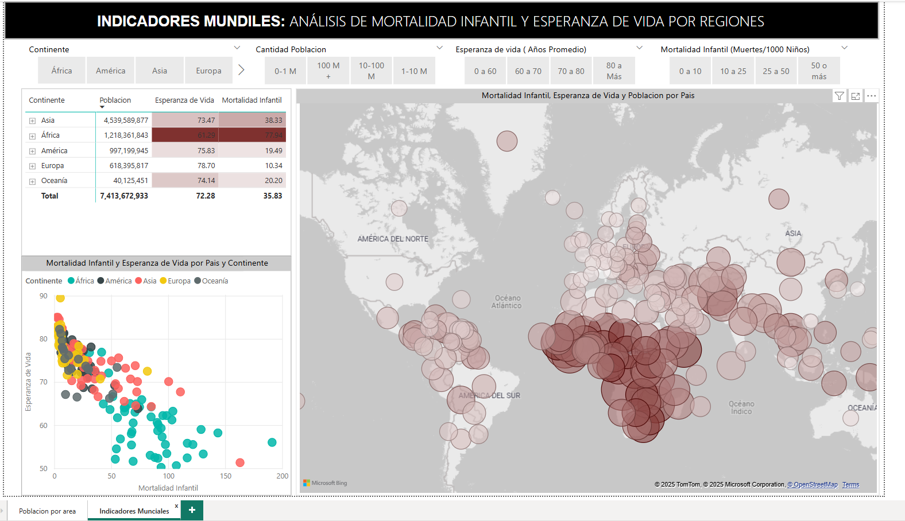

<h1 class="heading-element" dir="auto" tabindex="-1">Indicadores Mundiales</h1>

Dashboard de Indicadores mundiales que&nbsp; contiene las siguientes p&aacute;ginas:  <strong>-Poblaci&oacute;n por &aacute;rea:</strong> Puedes elegir entre&nbsp; pa&iacute;ses o rango de cantidad de poblaci&oacute;n y verlo representado en el reporte. <strong>-Indicadores Mundiales:</strong> An&aacute;lisis de Mortalidad Infantil y esperanza de vida por regiones.

<em>El archivo en Power Bi se encuentra en la carpeta Indicadores Mundiales&nbsp; y la base de datos como las&nbsp; im&aacute;genes en la carpeta Data</em>

&nbsp;

&nbsp;
