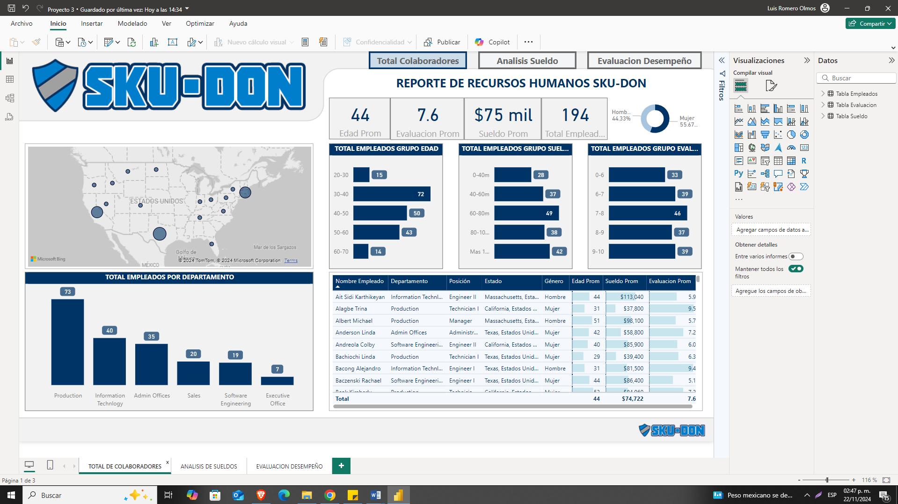
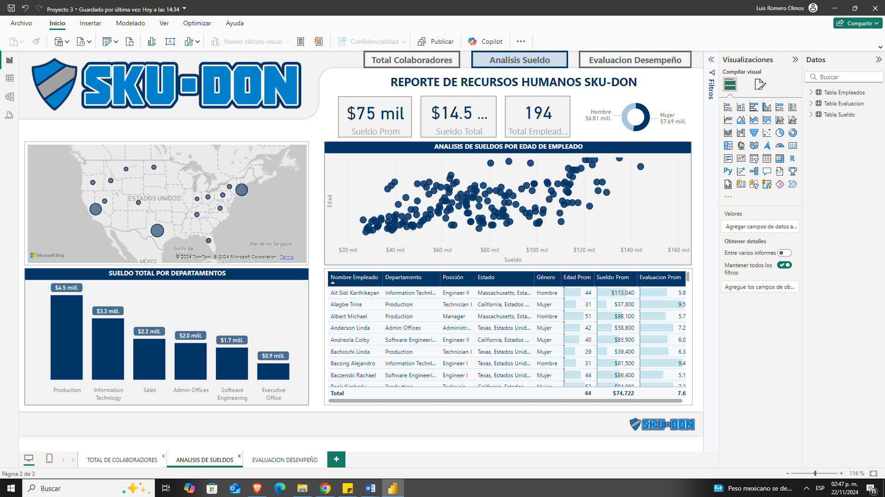
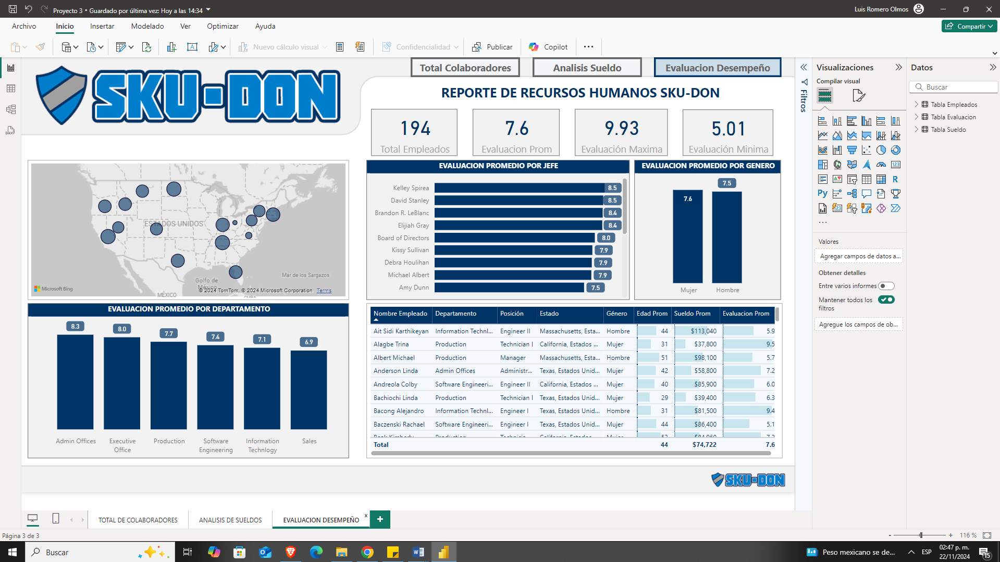

<h1>Recursos Humanos SKU-DON</h1>

Dashboard de recursos humanos, contiene las siguientes p&aacute;ginas:  -Total de Colaboradores -An&aacute;lisis de Sueldos -Evaluaci&oacute;n de desempe&ntilde;o

&nbsp;

<em>El archivo en PowerBi se encuentra en la carpeta Recursos Humanos y la base de datos como im&aacute;genes en la carpeta Data</em>

&nbsp;

&nbsp;
